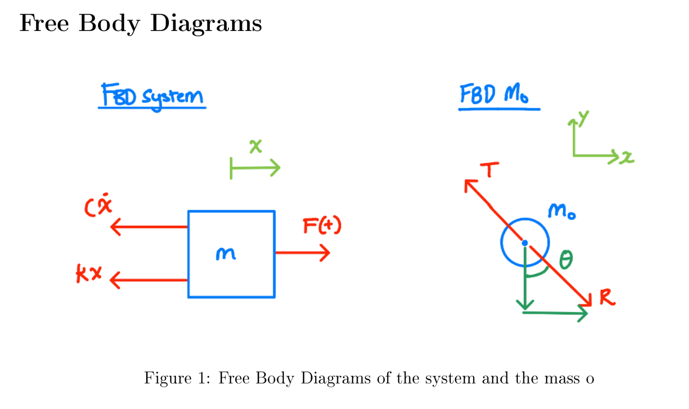
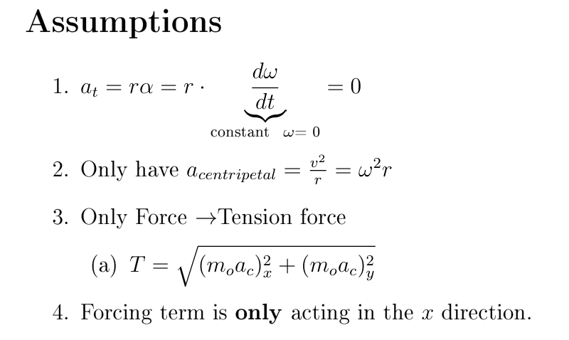
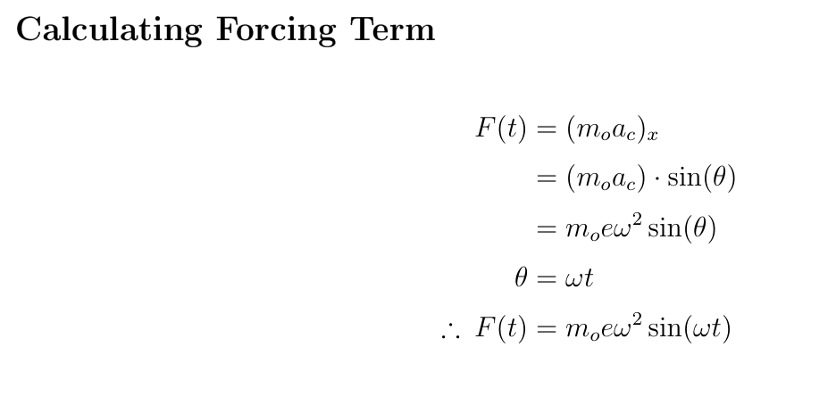
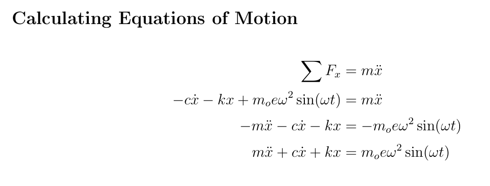
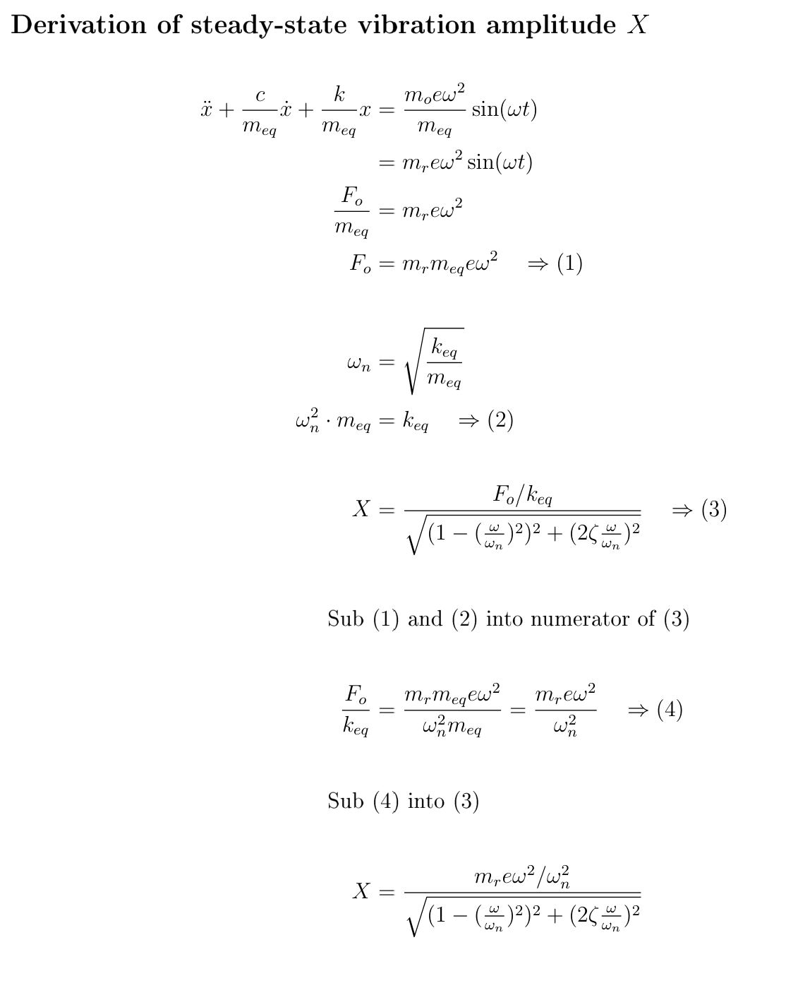
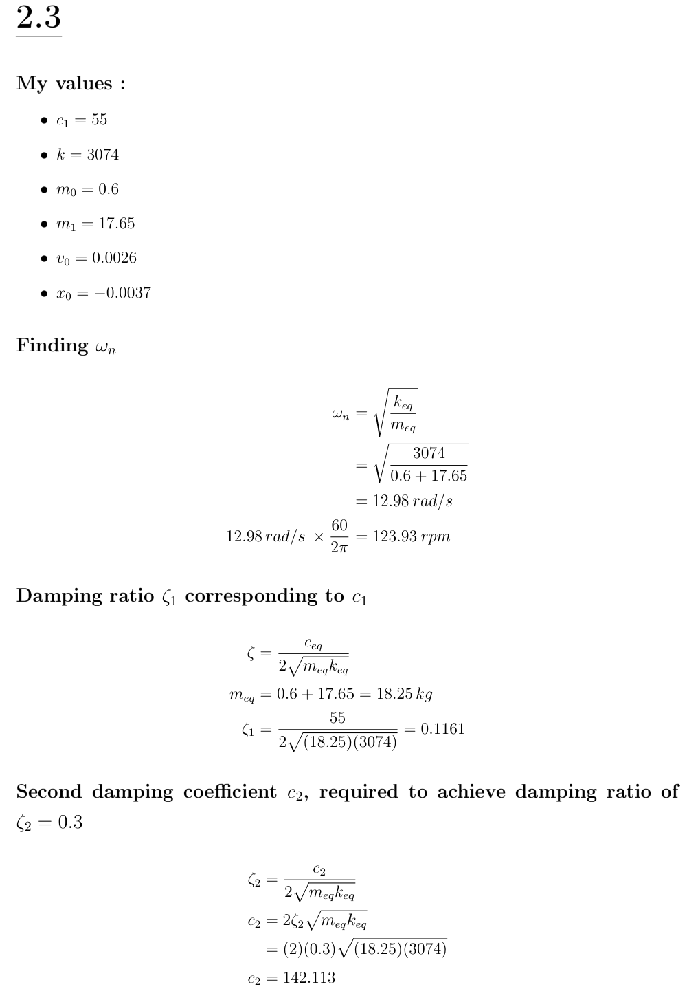
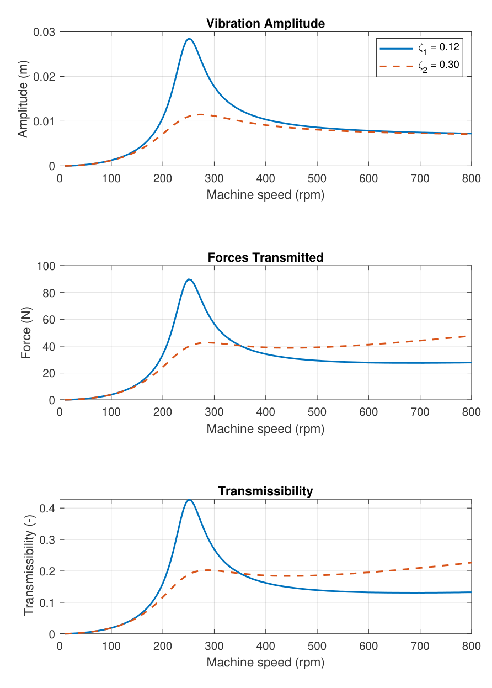
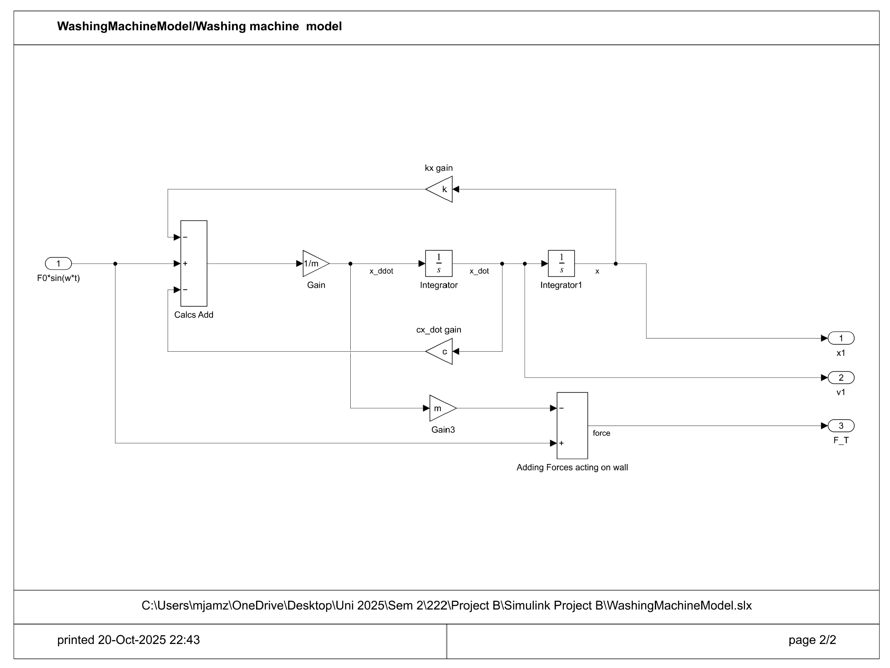

# Dynamic analysis of vibration systems

## 📌 Overview

This project related to a new topic we learnt in our dynamics course called vibrations. This project tested our understanding of the key concepts of spring-damper systems and how the response can affect real scenarios. In this case, the scenario was a top loading washing machine with washing load in it. This projected investigated how different spring stiffness and damping coefficients affected the vibration induced from the machine as the RPM increased. We were also introduced to simulink and how to model responses from spring-damper systems.

## 🎯 Objectives
- Evaluate the equations of motions
- Derive the steady-state vibration amplitude
- Using my uniquely given values to calculate the natural frequency, damping ratio, and the damping coefficient with a different damping ratio
- Model the response of vibration amplitude, forces transmitted and transmissibility using simulink

## 🛠 Tools & Concepts Used
- MATLAB
- Vibrational Analysis
- Simulink

## 🔍 Methodology

To tackle this project, I needed to understand the fundamentals of the spring damper system and understand how the mass was interacting with the system. To visualise the problem, I drew up Free Body Diagrams (FBD's) to aid in understanding the problem with the forces acting on the machine. After drawing the FBD's, I stated all the important assumptions and calculate the forcing term. The assumptions I concluded was that there was only a centriptal acceleration of the load acting on the washing machine, the only force acting on the machine was the tension force of the load, and the forcing term was only acting in the x direction. Once the forcing term was calculated, I could derive a full equation of motion. Using the equation of motion, I could derive the steady-state vibration amplitude. Using my uniquely given values, I could calculate the natural frequency, damping ratio, and the damping coefficient with a different damping ratio.  

Next, I turned to MATLAB and simulink for the modelling and analysis of the system. This was a particular difficult part of the project as I had never used simulink prior to this project. The understanding of how MATLAB workspace could be used in the simulink workspace was challenging to understand. With the help of tutorial sessions and brief instructions, I completed the analysis of the different spring damper systems. 

## 📊 Results
<!-- From the analysis, we could see that as the machine speed increases, the vibration amplitude, transmitted forces and transmissibility increases and would peak at 250 rpm. The maximum vibration amplitude with damping ratio 1 (ζ1) was 28.48 mm, while with damping ratio 2 (ζ2), the maximum vibration amplitude was 11.05mm. The maximum amount of transmitted force was 89.91N with ζ1 and 36.69N with ζ2. Lastly, the transmissibility with ζ1 was 0.43 and with ζ2 was 0.19. 

From the graphs, I concluded that the the ζ2 line has a much lesser peak compared with ζ1, but still reaches a same steady state towards the higher speeds. This means that the vibration amplitude still reached the same steady state displacement, but the max displacement is signi?cantly lesser with the change in damping value. The transmitted forces also tends to reach a very high peak
with ζ1, but with ζ2, it does not reach a very high amount of force. However, with ζ1, the forces do decrease after the peak and tend to lead to a steady state at approximately 27.5N. With the ζ2, the force transmitted tends to increase after the peak as well, which could mean that the high damping value does reduce the peak force that acts on the wall of the machine, but it will increase as speed increases. The transmissibility also follows the same trend as the forces transmitted, which means that with ζ1, the transmissibility does decrease as speed goes up. With ζ2, the peak value of transmissibility is much lesser, but as speed increases, transmissibility increases as well. -->

From the analysis : As the machine speed increases, the vibration amplitude, transmitted forces and transmissibility increases and peaks at 250 rpm.

*Maximum vibration amplitude*  
Damping ratio 1 (ζ1) : **28.48 mm**  
Damping ratio 2 (ζ2) : **11.05 mm**  

*Maximum transmitted force*  
Damping ratio 1 (ζ1) : **89.1 N**  
Damping ratio 2 (ζ2) : **36.69 N**  

*Maximum Transmissibility*  
Damping ratio 1 (ζ1) : **0.43**  
Damping ratio 2 (ζ2) : **0.19**  

**Key Findings**
- ζ2 line has a much lesser peak compared with ζ1 line
- Vibration amplitude with ζ2 is lesser than with ζ1
- Vibration amplitude reaches same steady state at higher RPMs
- The high damping value does reduce the peak force that acts on the wall of the machine, but it will increase as RPMs increases
- The transmissibility also follows the same trend as the forces transmitted, where transmissibility increases as RPMs increase

## 📸 Project Images
The images below were taken from my assignment report and the equations were prepared using LaTeX for mathematcial formatting.   

  

  <i>Figure 1: Free body diagram of system</i>

<!-- -->

  

  <i>Figure 2: Assumptions for scenario</i>

<!-- -->

  

  <i>Figure 3: Calculating the forcing term</i>

<!-- -->

  

  <i>Figure 4: Calculating the equations of motion</i>

<!-- -->

  

  <i>Figure 5: Calculating the steady state vibration amplitude</i>

<!-- -->

  

  <i>Figure 6: Unique values and calculations </i>

<!-- -->

  

  <i>Figure 7: Graphs from Simulink analysis </i>

<!-- -->

  

  <i>Figure 8: Simulink model </i>

<!-- -->

## 📚 What I Learned
- Understood the fundamental knowledge of spring-damper systems
- Leant how different components affect a system in a real scenario
- The use of simulink modelling with matlab workspace
